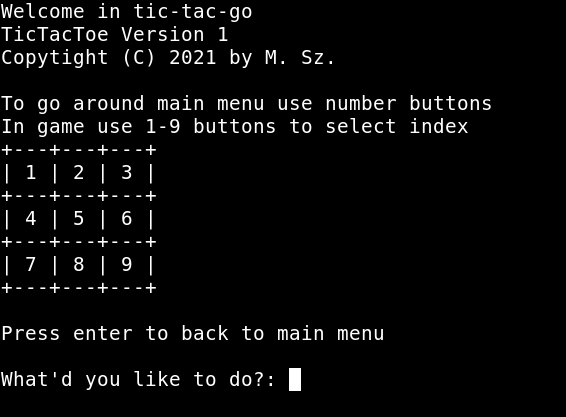

[](https://circleci.com/gh/gucio321/tic-tac-go/tree/master)

## About

Tic-Tac-Go is a simple, command line implementation
of tic-tac-toe game written in [Golang](https://golang.org)

## Requirements

to run the game you only need to install [golang](https://golang.org)

### Installation

To install the game simple run `go install github.com/gucio321/tic-tac-go`

### How to run?

After installation, just execute `go run github.com/gucio321/tic-tac-go`

You can also download the source by `git clone https://github.com/gucio321/tic-tac-go`
and then:

```sh
cd tic-tac-go
go get -d ./...
go run .
```

## Screenshots



