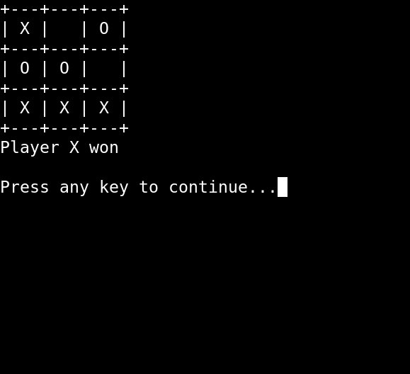
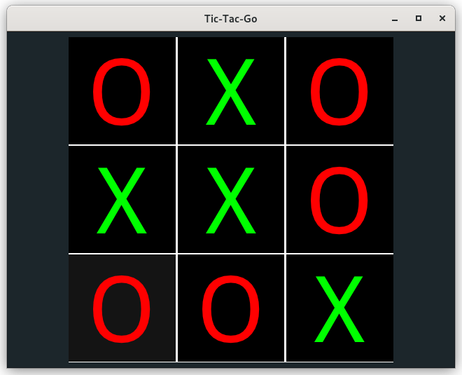

[](https://goreportcard.com/report/github.com/gucio321/tic-tac-go)
[](https://pkg.go.dev/mod/github.com/gucio321/tic-tac-go)

## About

Tic-Tac-Go is an implementation
of the tic-tac-toe game written in [Golang](https://golang.org)

## Requirements

to run the game you only need to install [golang](https://golang.org)

if you want to run a giu version of the game, you'll need some dependencies
on linux, run:
```sh
sudo apt-get install -y libgtk-3-dev libasound2-dev libxxf86vm-dev
```

for more details, see a documentation of giu: https://github.com/AllenDang/giu#install

### Installation

To install the game, first download it: `go get github.com/gucio321/tic-tac-go`
and let's GO!
Since now, an executale binary will be present in `$GOPATH/bin/`

### How to run?

After installation, just execute `go run github.com/gucio321/tic-tac-go`
or `$GOPATH/bin/tic-tac-go`

You can also download the source by `git clone https://github.com/gucio321/tic-tac-go`
and then:

```sh
cd tic-tac-go
go get -d ./...
go run .
```

## Screenshots





## Motivation

When I'm learning a new programming language, I'm writtin a game
like that to check myself. Because I liked the [golang](https://golang.org),
I decided to share and improve my work.
